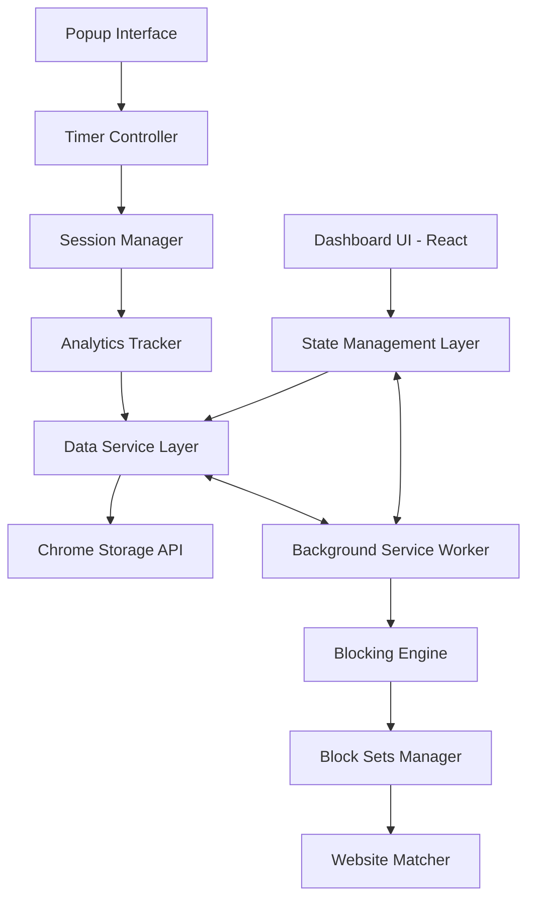

# Design Document

## Overview

The App Blocker Dashboard Enhancement transforms the existing Chrome extension into a comprehensive productivity management platform. The design follows a serverless-first architecture using Chrome Storage API for local data persistence, with modular components that support future cloud integration. The system features an advanced 6 Block Sets system, comprehensive analytics, and a React-based dashboard interface.

## Architecture

### System Architecture



### Core Principles

1. **Serverless-First**: All functionality operates locally without external dependencies
2. **Modular Design**: Clear separation between UI, business logic, and data layers
3. **Extensible Architecture**: Prepared for future server integration without core changes
4. **Performance-Focused**: Efficient data structures and minimal background processing
5. **User-Centric**: Intuitive interface with comprehensive customization options

## Components and Interfaces

### 1. Dashboard Interface (React Components)

#### Main Dashboard Layout

- **Header Navigation**: Timer status, block set selector, settings access
- **Analytics Overview**: Key metrics cards (focus time, completion rate, blocks today)
- **Timer Section**: Full Pomodoro interface with session controls
- **Charts Section**: Weekly productivity and category breakdown visualizations
- **Block Sets Management**: Configuration interface for all 6 block sets

#### Component Structure

```
Dashboard/
├── Header/
│   ├── TimerStatus.jsx
│   ├── BlockSetSelector.jsx
│   └── SettingsButton.jsx
├── Analytics/
│   ├── MetricsCards.jsx
│   ├── WeeklyChart.jsx
│   └── CategoryChart.jsx
├── Timer/
│   ├── TimerDisplay.jsx
│   ├── SessionControls.jsx
│   └── ProgressBar.jsx
└── BlockSets/
    ├── BlockSetList.jsx
    ├── BlockSetEditor.jsx
    └── CategoryManager.jsx
```

### 2. Block Sets System

#### Block Set Structure

Each of the 6 block sets contains:

- **Unique Identifier**: Set 1-6 with custom naming support
- **Website Categories**: Organized groups of blocked sites
- **Time-Based Rules**: Specific hours, days, date ranges
- **Blocking Behavior**: Immediate, delayed, or visit-count triggered
- **Integration Settings**: Pomodoro timer integration preferences

#### Block Set Manager Interface

```typescript
interface BlockSet {
  id: string;
  name: string;
  isActive: boolean;
  categories: Category[];
  timeRules: TimeRule[];
  blockingBehavior: BlockingBehavior;
  pomodoroIntegration: PomodoroSettings;
}

interface Category {
  id: string;
  name: string;
  websites: string[];
  color: string;
}

interface TimeRule {
  type: 'hours' | 'days' | 'dateRange';
  startTime?: string;
  endTime?: string;
  activeDays?: number[];
  startDate?: Date;
  endDate?: Date;
}
```

### 3. Analytics Engine

#### Data Collection

- **Session Tracking**: Start/end times, completion status, interruptions
- **Block Attempts**: Timestamp, website, block set, user action
- **Productivity Metrics**: Focus time, break time, efficiency scores
- **Usage Patterns**: Most blocked sites, peak productivity hours

#### Analytics Data Structure

```typescript
interface SessionData {
  id: string;
  type: 'work' | 'shortBreak' | 'longBreak';
  startTime: Date;
  endTime: Date;
  completed: boolean;
  interruptions: number;
  activeBlockSet: string;
}

interface BlockAttempt {
  timestamp: Date;
  website: string;
  blockSetId: string;
  categoryId: string;
  userAction: 'blocked' | 'bypassed' | 'closed';
}
```

### 4. Storage Layer

#### Chrome Storage API Implementation

- **Local Storage**: Session data, settings, temporary state
- **Sync Storage**: User preferences, block sets configuration
- **Data Versioning**: Migration support for future updates
- **Backup/Restore**: Export/import functionality

#### Storage Schema

```typescript
interface StorageSchema {
  // User Settings
  settings: {
    timer: TimerSettings;
    notifications: NotificationSettings;
    security: SecuritySettings;
    ui: UISettings;
  };

  // Block Sets Configuration
  blockSets: BlockSet[];
  activeBlockSetId: string;

  // Analytics Data
  sessions: SessionData[];
  blockAttempts: BlockAttempt[];

  // Metadata
  version: string;
  lastBackup: Date;
}
```

## Data Models

### Core Data Models

#### Timer Configuration

```typescript
interface TimerSettings {
  workDuration: number; // minutes (1-60)
  shortBreakDuration: number; // minutes (1-30)
  longBreakDuration: number; // minutes (1-60)
  longBreakInterval: number; // every N pomodoros
  autoStartBreaks: boolean;
  autoStartWork: boolean;
}
```

#### Notification System

```typescript
interface NotificationSettings {
  desktop: boolean;
  sound: boolean;
  sessionComplete: boolean;
  sessionStart: boolean;
  blockAttempt: boolean;
  soundFile?: string;
}
```

#### Security Configuration

```typescript
interface SecuritySettings {
  passwordProtection: boolean;
  passwordHash?: string;
  lockdownMode: boolean;
  lockdownDuringSession: boolean;
  requirePasswordForBlockSetChanges: boolean;
}
```

### Analytics Data Models

#### Productivity Metrics

```typescript
interface ProductivityMetrics {
  dailyFocusTime: number; // minutes
  weeklyFocusTime: number; // minutes
  completionRate: number; // percentage
  averageSessionLength: number; // minutes
  totalBlockAttempts: number;
  mostBlockedSites: Array<{ site: string; count: number }>;
  productivityScore: number; // calculated score 0-100
}
```

## Error Handling

### Error Categories

1. **Storage Errors**

   - Chrome Storage API failures
   - Data corruption detection
   - Migration failures
   - Quota exceeded scenarios

2. **Timer Errors**

   - Background script communication failures
   - Timer synchronization issues
   - Session state inconsistencies

3. **Blocking Errors**
   - Website matching failures
   - Block set activation errors
   - Permission-related blocking issues

### Error Recovery Strategies

```typescript
interface ErrorHandler {
  handleStorageError(error: StorageError): void;
  handleTimerError(error: TimerError): void;
  handleBlockingError(error: BlockingError): void;
  recoverFromCorruption(): Promise<boolean>;
  resetToDefaults(): void;
}
```

### Fallback Mechanisms

- **Default Configuration**: Restore basic functionality if settings are corrupted
- **Graceful Degradation**: Continue core operations even if advanced features fail
- **User Notification**: Clear error messages with recovery suggestions
- **Automatic Retry**: Intelligent retry logic for transient failures

## Testing Strategy

### Unit Testing

- **Component Testing**: React component behavior and rendering
- **Service Testing**: Data layer operations and business logic
- **Utility Testing**: Helper functions and data transformations

### Integration Testing

- **Chrome API Integration**: Storage, messaging, and extension APIs
- **Cross-Component Communication**: Message passing between components
- **Data Flow Testing**: End-to-end data operations

### User Acceptance Testing

- **Scenario-Based Testing**: Real-world usage patterns
- **Performance Testing**: Large dataset handling and responsiveness
- **Accessibility Testing**: Keyboard navigation and screen reader support

### Testing Framework

```typescript
// Jest + React Testing Library for components
// Chrome Extension Testing utilities for API mocking
// Cypress for end-to-end testing scenarios

describe('BlockSetManager', () => {
  test('should activate block set and update storage', async () => {
    // Test implementation
  });

  test('should handle storage errors gracefully', async () => {
    // Error handling test
  });
});
```

### Performance Considerations

#### Optimization Strategies

1. **Lazy Loading**: Load dashboard components on demand
2. **Data Pagination**: Limit analytics data rendering
3. **Efficient Storage**: Minimize Chrome Storage API calls
4. **Background Processing**: Offload heavy calculations to service worker
5. **Memory Management**: Clean up unused data and event listeners

#### Performance Metrics

- Dashboard load time < 500ms
- Block decision time < 50ms
- Storage operation time < 100ms
- Memory usage < 50MB
- CPU usage < 5% during idle

This design provides a comprehensive foundation for building a robust, scalable productivity dashboard while maintaining the flexibility to add server-based features in future phases.
