# Unified Mode Orchestration - Activity Diagram

```mermaid
flowchart TD
    Start([User clicks Start Timer]) --> CheckUnified{Unified Mode<br/>Enabled?}
    
    %% Non-Unified Mode Path
    CheckUnified -->|No| StartTimer[Start Timer Session]
    StartTimer --> RunTimer[Timer Running]
    
    %% Unified Mode Path
    CheckUnified -->|Yes| GetSettings[Get Unified Mode Settings]
    GetSettings --> CheckFocusCategory{Focus Category<br/>Configured?}
    
    CheckFocusCategory -->|No| ShowWarning[Show Configuration Warning]
    ShowWarning --> StartTimer
    
    CheckFocusCategory -->|Yes| GetCurrentActive[Get Current Active Category]
    GetCurrentActive --> StoreOriginal[Store Original Category State]
    StoreOriginal --> ApplyFocusCategory[Apply Focus Category]
    ApplyFocusCategory --> NotifyContentScripts[Notify Content Scripts<br/>Category Changed]
    NotifyContentScripts --> StartTimerUnified[Start Timer Session]
    StartTimerUnified --> RunTimerUnified[Timer Running<br/>with Category Applied]
    
    %% Timer Running States
    RunTimer --> CheckPause{User Pauses<br/>Timer?}
    RunTimerUnified --> CheckPauseUnified{User Pauses<br/>Timer?}
    
    CheckPause -->|Yes| PauseTimer[Timer Paused]
    CheckPauseUnified -->|Yes| PauseTimerUnified[Timer Paused<br/>Category Still Active]
    
    PauseTimer --> CheckResume{User Resumes<br/>Timer?}
    PauseTimerUnified --> CheckResumeUnified{User Resumes<br/>Timer?}
    
    CheckResume -->|Yes| RunTimer
    CheckResumeUnified -->|Yes| RunTimerUnified
    
    CheckPause -->|No| CheckComplete{Timer<br/>Complete?}
    CheckPauseUnified -->|No| CheckCompleteUnified{Timer<br/>Complete?}
    
    %% Timer Completion
    CheckComplete -->|No| RunTimer
    CheckCompleteUnified -->|No| RunTimerUnified
    
    CheckComplete -->|Yes| TimerComplete[Timer Complete<br/>Notification]
    CheckCompleteUnified -->|Yes| TimerCompleteUnified[Timer Complete<br/>Notification]
    
    %% Session Type Handling
    TimerComplete --> CheckSessionType{Check Session Type}
    TimerCompleteUnified --> CheckSessionTypeUnified{Check Session Type}
    
    CheckSessionType --> LogAnalytics[Log Session to Analytics]
    CheckSessionTypeUnified --> CheckBreakCategory{Break Category<br/>Configured?}
    
    CheckBreakCategory -->|Yes| ApplyBreakCategory[Apply Break Category]
    CheckBreakCategory -->|No| RestoreOriginal[Restore Original Category]
    
    ApplyBreakCategory --> NotifyBreakChange[Notify Content Scripts<br/>Break Category Applied]
    RestoreOriginal --> NotifyRestore[Notify Content Scripts<br/>Category Restored]
    
    NotifyBreakChange --> LogAnalyticsUnified[Log Session to Analytics]
    NotifyRestore --> LogAnalyticsUnified
    
    %% Auto-progression Logic
    LogAnalytics --> CheckAutoProgress{Auto-progress<br/>Enabled?}
    LogAnalyticsUnified --> CheckAutoProgressUnified{Auto-progress<br/>Enabled?}
    
    CheckAutoProgress -->|Yes| SwitchSession[Switch to Next Session]
    CheckAutoProgressUnified -->|Yes| SwitchSessionUnified[Switch to Next Session<br/>Check Category Config]
    
    CheckAutoProgress -->|No| End([Timer Session End])
    CheckAutoProgressUnified -->|No| End
    
    SwitchSession --> Start
    SwitchSessionUnified --> GetSettings
    
    %% Reset Handling
    CheckResume -->|Reset| ResetTimer[Reset Timer]
    CheckResumeUnified -->|Reset| ResetUnifiedTimer[Reset Timer &<br/>Restore Categories]
    
    ResetTimer --> End
    ResetUnifiedTimer --> RestoreOnReset[Restore Original Category]
    RestoreOnReset --> NotifyResetRestore[Notify Content Scripts<br/>Category Restored]
    NotifyResetRestore --> End
    
    %% Error Handling
    ApplyFocusCategory --> CheckApplyError{Category Apply<br/>Successful?}
    ApplyBreakCategory --> CheckBreakError{Break Category<br/>Apply Successful?}
    
    CheckApplyError -->|No| ShowError[Show Error Message<br/>Continue without Category]
    CheckBreakError -->|No| RestoreOriginal
    
    ShowError --> StartTimer
    
    %% Styling
    classDef startEnd fill:#e1f5fe,stroke:#01579b,stroke-width:2px
    classDef process fill:#f3e5f5,stroke:#4a148c,stroke-width:1px
    classDef decision fill:#fff3e0,stroke:#e65100,stroke-width:1px
    classDef unified fill:#e8f5e8,stroke:#2e7d32,stroke-width:2px
    classDef error fill:#ffebee,stroke:#c62828,stroke-width:1px
    
    class Start,End startEnd
    class StartTimer,RunTimer,PauseTimer,TimerComplete,LogAnalytics,SwitchSession,ResetTimer process
    class StartTimerUnified,RunTimerUnified,PauseTimerUnified,TimerCompleteUnified,LogAnalyticsUnified,SwitchSessionUnified,ResetUnifiedTimer,ApplyFocusCategory,ApplyBreakCategory,RestoreOriginal,NotifyContentScripts,NotifyBreakChange,NotifyRestore,NotifyResetRestore,GetSettings,GetCurrentActive,StoreOriginal unified
    class CheckUnified,CheckFocusCategory,CheckPause,CheckPauseUnified,CheckResume,CheckResumeUnified,CheckComplete,CheckCompleteUnified,CheckSessionType,CheckSessionTypeUnified,CheckBreakCategory,CheckAutoProgress,CheckAutoProgressUnified,CheckApplyError,CheckBreakError decision
    class ShowWarning,ShowError error
```

## Key Components Involved:

### **Services**
- **UnifiedOrchestrator**: Main coordinator for timer-category integration
- **TimerService**: Handles timer state and session management
- **CategoriesService**: Manages category activation and switching
- **SettingsService**: Retrieves unified mode configuration
- **AnalyticsService**: Logs session data and productivity metrics

### **Communication**
- **Message System**: Notifies content scripts of category changes
- **Chrome Storage**: Persists timer state and category configurations
- **Content Scripts**: Receives category updates to apply/remove blocking

### **Decision Points**
1. **Unified Mode Check**: Determines if integration should activate
2. **Category Configuration**: Validates focus/break category settings
3. **Session Type Logic**: Handles different behavior for focus vs break periods
4. **Auto-progression**: Manages automatic session switching
5. **Error Handling**: Graceful degradation when category operations fail

### **Key Features**
- **State Preservation**: Stores original category before applying focus category
- **Dual Path Support**: Works with or without unified mode enabled
- **Break Category Support**: Optional different blocking during breaks
- **Reset Handling**: Properly restores categories when timer is reset
- **Error Recovery**: Continues timer operation even if category operations fail

This diagram shows how your `UnifiedOrchestrator` coordinates between the timer and blocking systems, making it the signature feature that differentiates Bolt Blocker from basic timer extensions.